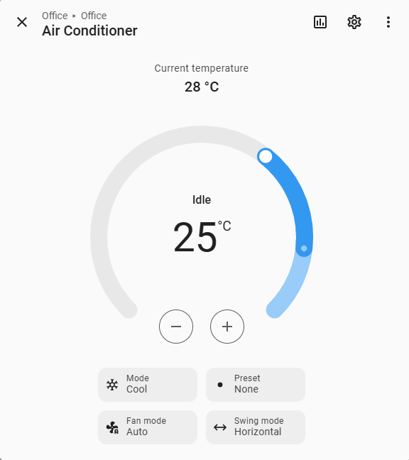

# Hisense AC for Home Assistant with ESPHome

[](https://github.com/akrabi/hisense_ac_esphome/actions/workflows/tests.yml)
[](https://github.com/akrabi/hisense_ac_esphome/releases/latest)

**Control your compatible Hisense-made air conditioner locally in Home Assistant,
without the vendor cloud.** This ESPHome external component works with a DIY
ESP32 and RS-485 adapter that replaces the original Wi-Fi module. Confirmed
setups include **Hisense, Tornado and ACOND** air conditioners.



*A real Home Assistant setup using this component. Available controls depend on the AC model.*

- **See what the AC actually did:** state comes from the unit by default, rather
  than assuming a command succeeded. Physical-remote changes are reflected too.
- **Control and monitor in one place:** Heat, Cool, Dry and Fan modes, fan and
  swing controls, plus optional display control, compressor frequency,
  temperature and humidity sensors.
- **Troubleshoot with useful feedback:** optional connection health, status age
  and error counters, plus detailed protocol logs.

For presets, model-specific [Dry adjustment](doc/configuration/README.md#optional-dry-adjustment)
and feature limitations, see the [configuration guide](doc/configuration/README.md).

[Quick start](#quick-start) | [Compatibility](#compatible-air-conditioners) |
[Wiring guide](doc/hardware/README.md) | [All configuration options](doc/configuration/README.md)

## Compatible air conditioners

These setups have been reported working with **this component**:

| AC model | Original Wi-Fi module |
| --- | --- |
| Tornado TOP-INV-120A (WIFI) | AEH-W4F1 |
| Tornado MULTI-12A (WIFI) (AST-09UW4RVETV00D, 2020) | AEH-W4G2 |
| Hisense AST-12UW4RVETG00A | AEH-W4E1 |
| ACOND ASTI-09UW4RVEDC00 | AEH-W4B1 |

See the [full compatibility notes](doc/hardware/COMPATIBLE_DEVICES.md) for the
TOP-INV-140A/180A variants and how to report a new setup.

> **Broader compatibility:** Additional Hisense, Ballu and Newtek models are
> [expected to be compatible](doc/hardware/COMPATIBLE_DEVICES.md#expected-compatible-models)
> based on public protocol information. Confirmation with this component is still
> pending, and optional features may vary by model.

## Quick start

You need an ESP32, an RS-485/UART adapter with **automatic direction switching**,
and the appropriate connector. Adapters requiring DE/RE control are not supported.

**Disconnect AC power at the circuit breaker before opening the unit.** Check
pinout, supply voltage and logic levels using the
[hardware and wiring guide](doc/hardware/README.md). Hardware modifications are
[at your own risk](#disclaimer).

1. Check your model and complete the [hardware setup](doc/hardware/README.md).
2. Create an ESP32 device in ESPHome Device Builder using the board you have.
   Keep its generated `esphome`, `esp32`, Wi-Fi, encrypted API and OTA settings.
3. Add the configuration below. Merge `logger` settings into your existing
   section rather than creating a second one. GPIO16/17 match the wiring example;
   use the pins you actually connected and a dedicated UART for each AC.
4. Install the firmware and add the ESPHome device to Home Assistant. The climate
   entity will report state after receiving a valid status from the AC.

```yaml
logger:
  baud_rate: 0

external_components:
  - source: github://akrabi/hisense_ac_esphome
    components: [hisense_ac]

uart:
  id: uart_bus
  tx_pin: GPIO17
  rx_pin: GPIO16
  baud_rate: 9600

climate:
  - platform: hisense_ac
    name: "Air Conditioner"
    uart_id: uart_bus
    temperature_unit: CELSIUS
    display:
      name: "Display"
```

Remove `display` if your unit does not support it. For optional sensors,
diagnostics and multi-room examples, see the
[configuration guide](doc/configuration/README.md).

By default, Home Assistant shows device-reported state. For immediate control
feedback followed by reconciliation, see
[`optimistic` and migration notes](doc/configuration/README.md#state-reporting-and-migration).

## Documentation and support

- [Configuration and examples](doc/configuration/README.md): sensors, diagnostics,
  optional controls and migration notes.
- [Protocol reference](doc/protocol.md) and [regression tests](tests/README.md):
  development details and ESP32 Arduino/ESP-IDF coverage. Software checks do not
  establish hardware compatibility.
- [Releases](https://github.com/akrabi/hisense_ac_esphome/releases) |
  [Issues](https://github.com/akrabi/hisense_ac_esphome/issues) |
  [Report a working model](doc/hardware/COMPATIBLE_DEVICES.md#adding-your-device).

Contributions are welcome. Remove passwords, API keys and other secrets from
logs and configurations before sharing.

## Acknowledgments

This project was built based on [esphome_airconintl](https://github.com/pslawinski/esphome_airconintl).

## Disclaimer

**USE AT YOUR OWN RISK**: This component is provided "as is" without warranty of any kind, express or implied. The author(s) and contributors of this component take no responsibility for any damage to your air conditioning unit, ESP32 device, or any other equipment that may occur as a result of using this component. By using this component, you acknowledge and agree that you are doing so at your own risk and that you will be solely responsible for any damage that may occur to your equipment.

## License

This project is released under the MIT License.
