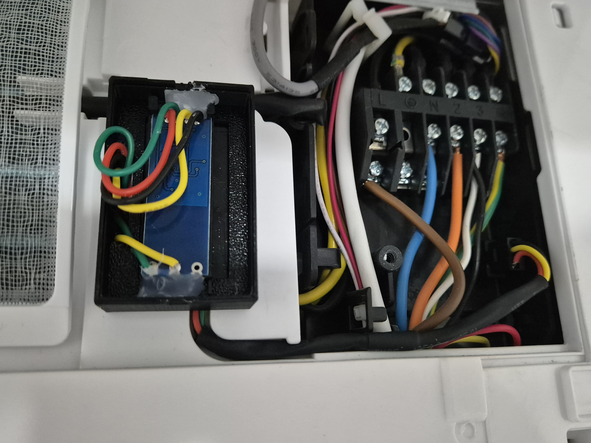

# Hardware

## Compatibility

This device is meant to replace the Hisense Wifi Module (e.g. AEH-W4F1, AEH-W4A1) and communicates with the AC over RS485 using the XM protocol.

The ESP32 is fed 5v directly form the AC unit, make sure that your AC outputs 5V, otherwise a buck converter is required.
The easiest way is to make sure your device is part of the [compatible devices](COMPATIBLE_DEVICES.md).

## Disassembly

1. **Power Off the AC**
   - Ensure the AC is completely powered off from the main circuit breaker for safety.
   

2. **Open Front Panel**
   - The front panel can be lifted upwards using both hands, one on each side of the panel.
   

3. **Access Control Board**
   - Remove the screws securing the electronic control box cover
   - Carefully detach the cover to access the control board
   

4. **Remove WiFi Module**
   - Identify the existing WiFi module
   - Note the orientation and connection points
   - Remove the screw securing the Wifi Module
   - Carefully disconnect the existing module
   
   

## Assembly

### Required parts
- ESP32 development board (tested with ESP-WROOM-32)
- RS485<->Uart(TTL) converter
- JST SM 2.54mm 4 Pin Male Connector

All parts can be easily found on AliExpress/Amazon.

### Wiring
1. **Wiring Diagram**
   
   
   Connect the components as follows:
   - ESP32 to RS485 converter:
     * ESP32 RX (GPIO16) → RS485 RXD
     * ESP32 TX (GPIO17) → RS485 TXD
     * ESP32 3.3V → RS485 VCC
     * ESP32 GND → RS485 GND
   - RS485 converter to JST connector:
     * RS485 A+ → JST pin 2 (A+)
     * RS485 B- → JST pin 3 (B-)
     * 5V → JST pin 1 (VCC)
     * GND → JST pin 4 (GND)

2. **JST Connector**
   - Ensure proper orientation of the JST connector
   - The connector pinout from left to right: VCC, A+, B-, GND
   

3. **Final Connection**
   - Connect your assembled module to the AC unit
   - Double-check all connections before powering on
   

## Troubleshooting

### Common Issues

1. **No Communication**
   - Verify TX/RX pins are correctly connected (TX → TX, RX → RX)
   - Confirm UART settings (baud rate, data bits, parity, stop bits)
   - Check ground connection between ESP32 and AC unit
   - Verify A/B lines aren't reversed on RS485 connection

2. **Erratic Behavior**
   - Enable debug logging to monitor communication
   - Verify power supply is stable (5V from AC unit)
   - Check for interference on UART lines
   - Ensure all connections are properly soldered/crimped

3. **Power Issues**
   - Verify the AC unit provides stable 5V output
   - Check for any loose connections
   - If voltage is unstable, consider adding a voltage regulator
